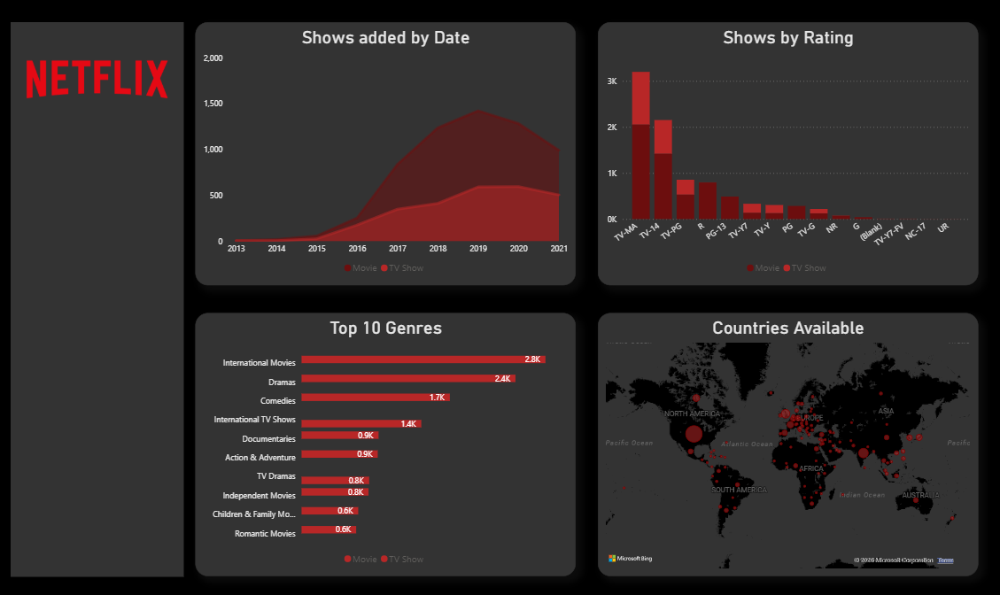
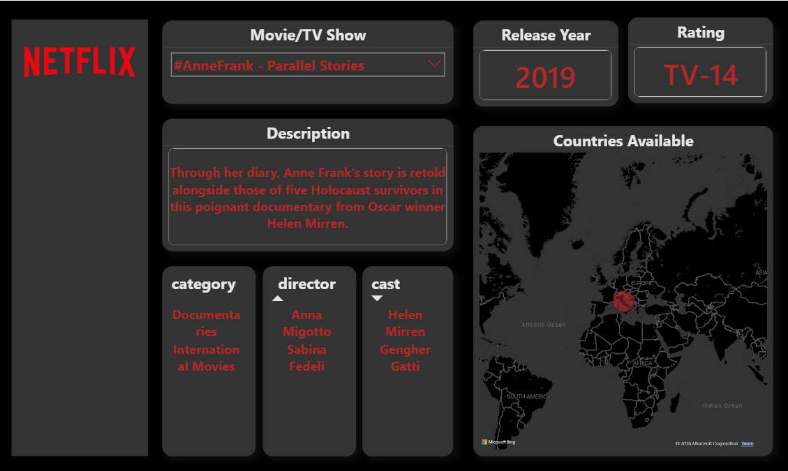

## Project Overview

Built an interactive Netflix Analytics Dashboard using Power BI to analyze content trends, ratings, genres, release years, and geographical distribution of movies and TV shows available on Netflix.

The project involved cleaning and preparing raw data in Excel, importing it into SQL for storage and querying, and finally creating interactive visualizations in Power BI.

---

## Tools Used

- Microsoft Excel
- SQL
- Power BI

---

## Project Workflow

1. Collected and examined the raw Netflix dataset.
2. Cleaned and transformed the data using Excel.
3. Imported the cleaned dataset into SQL.
4. Queried and organized data for analysis.
5. Connected SQL data to Power BI.
6. Designed interactive dashboards and reports.

---

## Dashboard Features

### Overview Dashboard

- Content added over time
- Distribution of content by rating
- Top 10 genres available on Netflix
- Country-wise content availability
- Interactive filtering and exploration

### Single Title Dashboard

- Title selection through slicer
- Release year information
- Content rating
- Detailed description
- Category information
- Cast details
- Country availability visualization

---

## Key Insights

- TV-MA is the most common content rating on Netflix.
- International Movies and Dramas are among the most popular content categories.
- Netflix experienced significant content growth between 2016 and 2020.
- Movies make up a larger share of Netflix content than TV Shows.
- Netflix content is distributed across multiple countries worldwide.

---

## Skills Demonstrated

- Data Cleaning
- Data Preparation
- SQL Querying
- Data Visualization
- Dashboard Design
- Business Intelligence Reporting

---

## Dashboard Preview

### Overview Dashboard

### Single Title Dashboard

---

## Project Outcome

The dashboard enables users to explore Netflix content interactively, identify content trends, analyze ratings and genres, and view detailed information for individual titles through a dedicated drill-down page.

---

## Author

Shivi Garg

LinkedIn: https://www.linkedin.com/in/shivi-garg-8885b9374

GitHub: github.com/shivigarg24
